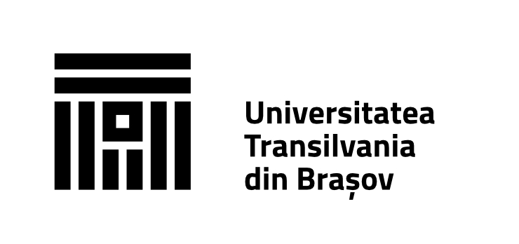

# Practica-UNITBV
## Descriere - tutorial python

**_Python_** este un limbaj de programare interpretat, de nivel înalt, cunoscut pentru sintaxa sa clară și concisă. Este folosit pe scară largă în dezvoltarea web, analiza datelor, inteligența artificială, automatizarea sarcinilor și multe altele. Datorită comunității sale mari și numeroaselor biblioteci disponibile, Python este o alegere populară atât pentru începători, cât și pentru programatori experimentați.

Pentru a invata mai usor _Python_ putem accesa [LearnPython.](https://www.learnpython.org)

